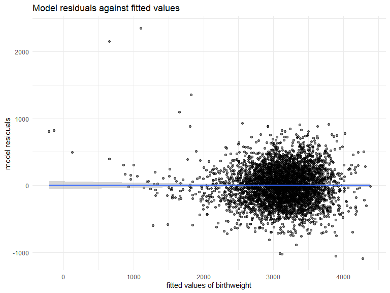
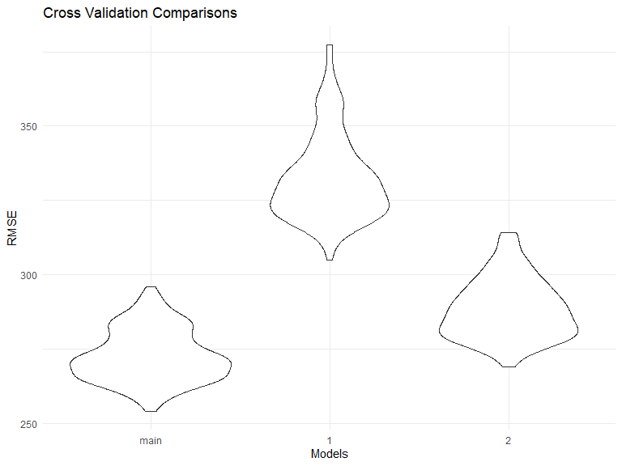

P8105 Homework 6
================
Pengyuan Su (ps3195)
11/25/2020

``` r
library(tidyverse)
library(modelr)
library(p8105.datasets)
library(mgcv)
```

    ## Loading required package: nlme

    ## 
    ## Attaching package: 'nlme'

    ## The following object is masked from 'package:dplyr':
    ## 
    ##     collapse

    ## This is mgcv 1.8-33. For overview type 'help("mgcv-package")'.

### Problem 1

``` r
homicide_df = 
  read_csv("data/homicide-data.csv", na = c("", "NA", "Unknown")) %>% 
  mutate(
    city_state = str_c(city, state, sep = ", "),
    victim_age = as.numeric(victim_age),
    resolution = case_when(
      disposition == "Closed without arrest" ~ 0,
      disposition == "Open/No arrest"        ~ 0,
      disposition == "Closed by arrest"      ~ 1)
  ) %>% 
  filter(
    victim_race %in% c("White", "Black"),
    city_state != "Tulsa, AL") %>% 
  select(city_state, resolution, victim_age, victim_race, victim_sex)
```

    ## 
    ## -- Column specification --------------------------------------------------------
    ## cols(
    ##   uid = col_character(),
    ##   reported_date = col_double(),
    ##   victim_last = col_character(),
    ##   victim_first = col_character(),
    ##   victim_race = col_character(),
    ##   victim_age = col_double(),
    ##   victim_sex = col_character(),
    ##   city = col_character(),
    ##   state = col_character(),
    ##   lat = col_double(),
    ##   lon = col_double(),
    ##   disposition = col_character()
    ## )

Start with one city.

``` r
baltimore_df =
  homicide_df %>% 
  filter(city_state == "Baltimore, MD")
glm(resolution ~ victim_age + victim_race + victim_sex, 
    data = baltimore_df,
    family = binomial()) %>% 
  broom::tidy() %>% 
  mutate(
    OR = exp(estimate),
    CI_lower = exp(estimate - 1.96 * std.error),
    CI_upper = exp(estimate + 1.96 * std.error)
  ) %>% 
  select(term, OR, starts_with("CI")) %>% 
  knitr::kable(digits = 3)
```

| term              |    OR | CI\_lower | CI\_upper |
| :---------------- | ----: | --------: | --------: |
| (Intercept)       | 1.363 |     0.975 |     1.907 |
| victim\_age       | 0.993 |     0.987 |     1.000 |
| victim\_raceWhite | 2.320 |     1.648 |     3.268 |
| victim\_sexMale   | 0.426 |     0.325 |     0.558 |

Try this across cities.

``` r
models_results_df = 
  homicide_df %>% 
  nest(data = -city_state) %>% 
  mutate(
    models = 
      map(.x = data, ~glm(resolution ~ victim_age + victim_race + victim_sex, data = .x, family = binomial())),
    results = map(models, broom::tidy)
  ) %>% 
  select(city_state, results) %>% 
  unnest(results) %>% 
  mutate(
    OR = exp(estimate),
    CI_lower = exp(estimate - 1.96 * std.error),
    CI_upper = exp(estimate + 1.96 * std.error)
  ) %>% 
  select(city_state, term, OR, starts_with("CI")) 
```

``` r
models_results_df %>% 
  filter(term == "victim_sexMale") %>% 
  mutate(city_state = fct_reorder(city_state, OR)) %>% 
  ggplot(aes(x = city_state, y = OR)) + 
  geom_point() + 
  geom_errorbar(aes(ymin = CI_lower, ymax = CI_upper)) + 
  theme(axis.text.x = element_text(angle = 90, hjust = 1))
```


## Problem 2

**import and tidy**

``` r
baby_df = 
  read_csv("./data/birthweight.csv") %>% 
  janitor::clean_names() %>% 
  drop_na() %>% 
  mutate(
    across(
      c("frace", "mrace"),
      ~ case_when(
        .x == 1 ~ "White",
        .x == 2 ~ "Black",
        .x == 3 ~ "Asian",
        .x == 4 ~ "Puero Rican",
        .x == 8 ~ "Other",
        .x == 9 ~ "Unknown"
      )
    ),
    babysex = case_when(
      babysex == 1 ~ "White",
      babysex == 2 ~ "Black"
    ) %>% as.factor(),
    malfrom = case_when(
      malform == 0 ~ "absent",
      malform == 1 ~ "present"
    ) %>% as.factor(),
    across(where(is.character), as.factor)
  )
```

    ## 
    ## -- Column specification --------------------------------------------------------
    ## cols(
    ##   .default = col_double()
    ## )
    ## i Use `spec()` for the full column specifications.

``` r
skimr::skim(baby_df)
```

|                                                  |          |
| :----------------------------------------------- | :------- |
| Name                                             | baby\_df |
| Number of rows                                   | 4342     |
| Number of columns                                | 21       |
| \_\_\_\_\_\_\_\_\_\_\_\_\_\_\_\_\_\_\_\_\_\_\_   |          |
| Column type frequency:                           |          |
| factor                                           | 4        |
| numeric                                          | 17       |
| \_\_\_\_\_\_\_\_\_\_\_\_\_\_\_\_\_\_\_\_\_\_\_\_ |          |
| Group variables                                  | None     |

Data summary

**Variable type: factor**

| skim\_variable | n\_missing | complete\_rate | ordered | n\_unique | top\_counts                             |
| :------------- | ---------: | -------------: | :------ | --------: | :-------------------------------------- |
| babysex        |          0 |              1 | FALSE   |         2 | Whi: 2230, Bla: 2112                    |
| frace          |          0 |              1 | FALSE   |         5 | Whi: 2123, Bla: 1911, Pue: 248, Asi: 46 |
| mrace          |          0 |              1 | FALSE   |         4 | Whi: 2147, Bla: 1909, Pue: 243, Asi: 43 |
| malfrom        |          0 |              1 | FALSE   |         2 | abs: 4327, pre: 15                      |

**Variable type: numeric**

| skim\_variable | n\_missing | complete\_rate |    mean |     sd |      p0 |     p25 |     p50 |     p75 |   p100 | hist  |
| :------------- | ---------: | -------------: | ------: | -----: | ------: | ------: | ------: | ------: | -----: | :---- |
| bhead          |          0 |              1 |   33.65 |   1.62 |   21.00 |   33.00 |   34.00 |   35.00 |   41.0 | ▁▁▆▇▁ |
| blength        |          0 |              1 |   49.75 |   2.72 |   20.00 |   48.00 |   50.00 |   51.00 |   63.0 | ▁▁▁▇▁ |
| bwt            |          0 |              1 | 3114.40 | 512.15 |  595.00 | 2807.00 | 3132.50 | 3459.00 | 4791.0 | ▁▁▇▇▁ |
| delwt          |          0 |              1 |  145.57 |  22.21 |   86.00 |  131.00 |  143.00 |  157.00 |  334.0 | ▅▇▁▁▁ |
| fincome        |          0 |              1 |   44.11 |  25.98 |    0.00 |   25.00 |   35.00 |   65.00 |   96.0 | ▃▇▅▂▃ |
| gaweeks        |          0 |              1 |   39.43 |   3.15 |   17.70 |   38.30 |   39.90 |   41.10 |   51.3 | ▁▁▂▇▁ |
| malform        |          0 |              1 |    0.00 |   0.06 |    0.00 |    0.00 |    0.00 |    0.00 |    1.0 | ▇▁▁▁▁ |
| menarche       |          0 |              1 |   12.51 |   1.48 |    0.00 |   12.00 |   12.00 |   13.00 |   19.0 | ▁▁▂▇▁ |
| mheight        |          0 |              1 |   63.49 |   2.66 |   48.00 |   62.00 |   63.00 |   65.00 |   77.0 | ▁▁▇▂▁ |
| momage         |          0 |              1 |   20.30 |   3.88 |   12.00 |   18.00 |   20.00 |   22.00 |   44.0 | ▅▇▂▁▁ |
| parity         |          0 |              1 |    0.00 |   0.10 |    0.00 |    0.00 |    0.00 |    0.00 |    6.0 | ▇▁▁▁▁ |
| pnumlbw        |          0 |              1 |    0.00 |   0.00 |    0.00 |    0.00 |    0.00 |    0.00 |    0.0 | ▁▁▇▁▁ |
| pnumsga        |          0 |              1 |    0.00 |   0.00 |    0.00 |    0.00 |    0.00 |    0.00 |    0.0 | ▁▁▇▁▁ |
| ppbmi          |          0 |              1 |   21.57 |   3.18 |   13.07 |   19.53 |   21.03 |   22.91 |   46.1 | ▃▇▁▁▁ |
| ppwt           |          0 |              1 |  123.49 |  20.16 |   70.00 |  110.00 |  120.00 |  134.00 |  287.0 | ▅▇▁▁▁ |
| smoken         |          0 |              1 |    4.15 |   7.41 |    0.00 |    0.00 |    0.00 |    5.00 |   60.0 | ▇▁▁▁▁ |
| wtgain         |          0 |              1 |   22.08 |  10.94 | \-46.00 |   15.00 |   22.00 |   28.00 |   89.0 | ▁▁▇▁▁ |

**fit a model**

I will use stepwise to choose a model, it is choosing a model by AIC in
a stepwise algorithm.

``` r
model1 = 
  lm(bwt ~ ., data = baby_df) %>% 
  step(trace = 0)

summary(model1)
```

    ## 
    ## Call:
    ## lm(formula = bwt ~ babysex + bhead + blength + delwt + fincome + 
    ##     gaweeks + mheight + mrace + parity + ppwt + smoken, data = baby_df)
    ## 
    ## Residuals:
    ##      Min       1Q   Median       3Q      Max 
    ## -1097.18  -185.52    -3.39   174.14  2353.44 
    ## 
    ## Coefficients:
    ##                    Estimate Std. Error t value Pr(>|t|)    
    ## (Intercept)      -6145.1507   141.9496 -43.291  < 2e-16 ***
    ## babysexWhite       -28.5580     8.4549  -3.378 0.000737 ***
    ## bhead              130.7770     3.4466  37.944  < 2e-16 ***
    ## blength             74.9471     2.0190  37.120  < 2e-16 ***
    ## delwt                4.1067     0.3921  10.475  < 2e-16 ***
    ## fincome              0.3180     0.1747   1.820 0.068844 .  
    ## gaweeks             11.5925     1.4621   7.929 2.79e-15 ***
    ## mheight              6.5940     1.7849   3.694 0.000223 ***
    ## mraceBlack         -63.9057    42.3663  -1.508 0.131523    
    ## mracePuero Rican   -25.7914    45.3502  -0.569 0.569578    
    ## mraceWhite          74.8868    42.3146   1.770 0.076837 .  
    ## parity              96.3047    40.3362   2.388 0.017004 *  
    ## ppwt                -2.6756     0.4274  -6.261 4.20e-10 ***
    ## smoken              -4.8434     0.5856  -8.271  < 2e-16 ***
    ## ---
    ## Signif. codes:  0 '***' 0.001 '**' 0.01 '*' 0.05 '.' 0.1 ' ' 1
    ## 
    ## Residual standard error: 272.3 on 4328 degrees of freedom
    ## Multiple R-squared:  0.7181, Adjusted R-squared:  0.7173 
    ## F-statistic: 848.1 on 13 and 4328 DF,  p-value: < 2.2e-16

And the results suggest that the pick by stepwise is:

bwt \~ babysex + bhead + blength + delwt + fincome + gaweeks + mheight +
mrace + parity + ppwt + smoken

``` r
fit_model = 
   lm(bwt ~ babysex + bhead + blength + delwt + fincome + 
    gaweeks + mheight + mrace + parity + ppwt + smoken, data = baby_df)
```

``` r
baby_df %>% 
  add_predictions(fit_model) %>% 
  add_residuals(fit_model) %>% 
  ggplot(aes(x = pred, y = resid)) +
  geom_point(alpha = 0.5) +
  geom_smooth(method = "lm",) +
  labs(x = 'fitted values of birthweight', y = 'model residuals', title = 'Model residuals against fitted values')
```

    ## `geom_smooth()` using formula 'y ~ x'



The plot shows that there may be no linear relationship between fitted
values and residuals of models since the lm-smooth line is extremely
close to the x-axis. Also, center of model residuals’ distribution is
around 0.

**Other Model**

Model 1: bwt \~ blength + gaweeks

Model 2: bwt \~ bhead + blength + babysex + bhead \* blength + bhead \*
babysex + blength \* babysex + bhead \* blength \* babysex

**Cross validation:**

``` r
set.seed(51)

cv = 
  modelr::crossv_mc(baby_df, 200, id = "id") %>% 
  mutate(
    model_main = map(.x = train, ~lm(bwt ~ babysex + bhead + blength + delwt + fincome + gaweeks + mheight + mrace + parity + ppwt + smoken, data = .x)),
    model_1 =  map(.x = train,  ~ lm(bwt ~ blength + gaweeks, data = .x)),
    model_2 = map(.x = train,  ~ lm(bwt ~ bhead + blength + babysex + bhead * blength + bhead * babysex + blength * babysex + bhead * blength * babysex, data = .x))
  ) %>% 
  mutate(
    rmse_main = map2_dbl(.x = model_main, .y = test, ~rmse(.x, .y)),
    rmse_1 = map2_dbl(.x = model_1, .y = test, ~rmse(.x, .y)),
    rmse_2 = map2_dbl(.x = model_2, .y = test, ~rmse(.x, .y))
  )

cv %>% 
  select(starts_with("rmse")) %>% 
  pivot_longer(
    everything(),
    names_to = "model", 
    values_to = "rmse",
    names_prefix = "rmse_") %>% 
  mutate(model = fct_inorder(model)) %>% 
  ggplot(aes(x = model, y = rmse)) + geom_violin() +
  labs(
        title = "Cross Validation Comparisons",
        x = "Models",
        y = "RMSE")
```



It seems that my model has the lowest rmse among these three models, and
the second model is better than the first model since it has lower rmse.

## Problem 3

**Read and tidy data**

``` r
weather_df = 
  rnoaa::meteo_pull_monitors(
    c("USW00094728"),
    var = c("PRCP", "TMIN", "TMAX"), 
    date_min = "2017-01-01",
    date_max = "2017-12-31") %>%
  mutate(
    name = recode(id, USW00094728 = "CentralPark_NY"),
    tmin = tmin / 10,
    tmax = tmax / 10) %>%
  select(name, id, everything())
```

    ## Registered S3 method overwritten by 'hoardr':
    ##   method           from
    ##   print.cache_info httr

    ## using cached file: C:\Users\supy\AppData\Local\cache/R/noaa_ghcnd/USW00094728.dly

    ## date created (size, mb): 2020-12-05 10:14:05 (7.549)

    ## file min/max dates: 1869-01-01 / 2020-12-31

``` r
weather_df %>% 
  ggplot(aes(x = tmin, y = tmax)) +
  geom_point(alpha = 0.4) +
  geom_smooth(method = "lm")
```

    ## `geom_smooth()` using formula 'y ~ x'


Bootstraps

``` r
set.seed(51)

boot_df = 
  weather_df %>% 
  modelr::bootstrap(n = 5000, id = "id") %>% 
  mutate(
    model = map(strap, ~lm(tmax ~ tmin, data = .x)),
    r_glance = map(model, broom::glance),
    beta = map(model, broom::tidy)
  ) %>% 
  unnest(r_glance, beta) %>%
  select(id, term, estimate, r.squared) %>% 
  mutate(term = recode(term, "(Intercept)" = "beta_0", "tmin" = "beta_1")) %>% 
  pivot_wider(
    names_from = term,
    values_from = estimate
  ) %>% 
  mutate(log_beta = log(beta_1 * beta_0))
```

``` r
boot_df %>% 
  ggplot(aes(x = r.squared, y = ..density..)) +
  geom_histogram(alpha = 0.5) +
  geom_density(aes(x = r.squared, y = ..density..)) +
  labs(title = "Distribution of r^2",
      x = quote(R^2))
```

    ## `stat_bin()` using `bins = 30`. Pick better value with `binwidth`.


The distribution of \(R^2\) is approximately normal distributed with
mean of 0.9116011.

``` r
boot_df %>% 
  ggplot(aes(x = log_beta, y = ..density..)) +
  geom_histogram(alpha = 0.5) +
  geom_density(aes(x = log_beta, y = ..density..)) +
  labs(title = "Distribution of log(beta0_hat * beta1_hat)",
       x = "log(beta0_hat * beta1_hat)")
```

    ## `stat_bin()` using `bins = 30`. Pick better value with `binwidth`.


The distribution of log(beta0\_hat \* beta1\_hat) is approximately
normal distributed with a mean of 2.0125905.

``` r
# 95% CI for r^2
quantile(boot_df$r.squared, probs = c(0.025, 0.975)) %>% knitr::kable(caption = "95% CI for R^2")
```

|       |         x |
| :---- | --------: |
| 2.5%  | 0.8940398 |
| 97.5% | 0.9273974 |

95% CI for R^2

``` r
# 95% CI for log(beta0_hat * beta1_hat)
quantile(boot_df$log_beta, probs = c(0.025, 0.975)) %>% knitr::kable(caption = "95% CI for log(beta0_hat * beta1_hat)")
```

|       |        x |
| :---- | -------: |
| 2.5%  | 1.964255 |
| 97.5% | 2.057736 |

95% CI for log(beta0\_hat \* beta1\_hat)
